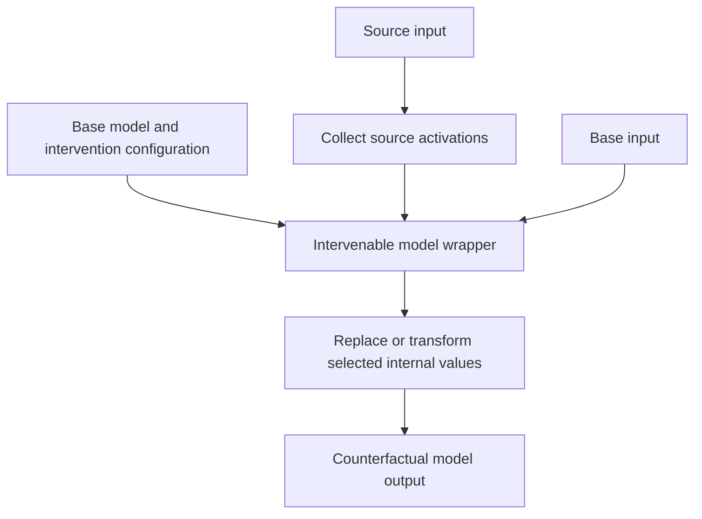

# A human guide to pyvene

Pyvene lets you change selected internal activations of a PyTorch model and observe how its output changes. Instead of rewriting the model, you describe an intervention and wrap the original model with the machinery that applies it.

[`pyvene/models/configuration_intervenable_model.py`](pyvene/models/configuration_intervenable_model.py) describes where interventions attach. [`pyvene/models/intervenable_base.py`](pyvene/models/intervenable_base.py) coordinates the wrapped model and interventions. [`pyvene/models/interventions.py`](pyvene/models/interventions.py) defines the transformations. Model-specific folders map the shared concepts to particular architectures.

The key distinction is between a base example, whose output you want to study, and a source example, whose internal values may be injected. Positions, layers, and component names determine exactly what is changed. The result is a counterfactual computation, not automatically a causal explanation of every model behavior.

The local collator implementation in [`pyvene/models/data_collator.py`](pyvene/models/data_collator.py) prepares training batches carrying both base and source token sequences. It pads those sets independently, since their lengths can differ, then returns them with the expected keys.

Read [`pyvene_101.ipynb`](pyvene_101.ipynb), one intervention configuration, and its selected intervention class. [`tests/`](tests/) provides concrete examples of the supported combinations. Existing upstream API documentation is retained.
